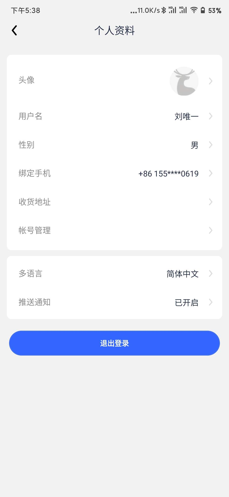

# 使用React Native仿写 瑞幸APP

## 使用方法

本项目依赖于`Expo`，项目clone下来后

```bash
yarn
yarn start
```

## 依赖

- 虽然没用多少东西，但是还是用了的第三方UI框架 [UI Kitten](https://akveo.github.io/react-native-ui-kitten/)
- 全局状态管理 [Redux](https://redux.js.org/)
- 轮播图 [react-native-swiper](https://github.com/leecade/react-native-swiper)
- 导航 [React Navigation](https://reactnavigation.org/)
- 数据库 [expo-sqlite](https://www.npmjs.com/package/expo-sqlite)
- ORM [expo-sqlite-orm](https://www.npmjs.com/package/expo-sqlite-orm)

等更多依赖，详细请见 `package.json`

## 实现

- 主页
- 菜单
- 商品详情
- 购物车
- 我的
- 个人资料

## 未实现

- 菜单下拉Header收起的动画
- 订单页
- 登录页

等各种功能

## 界面预览




## PS

纪念一下瑞幸，哎，可惜了，不知道还能再坚持多长时间，更不知道回北京的时候还有没有那些令人怀念的优惠券了。